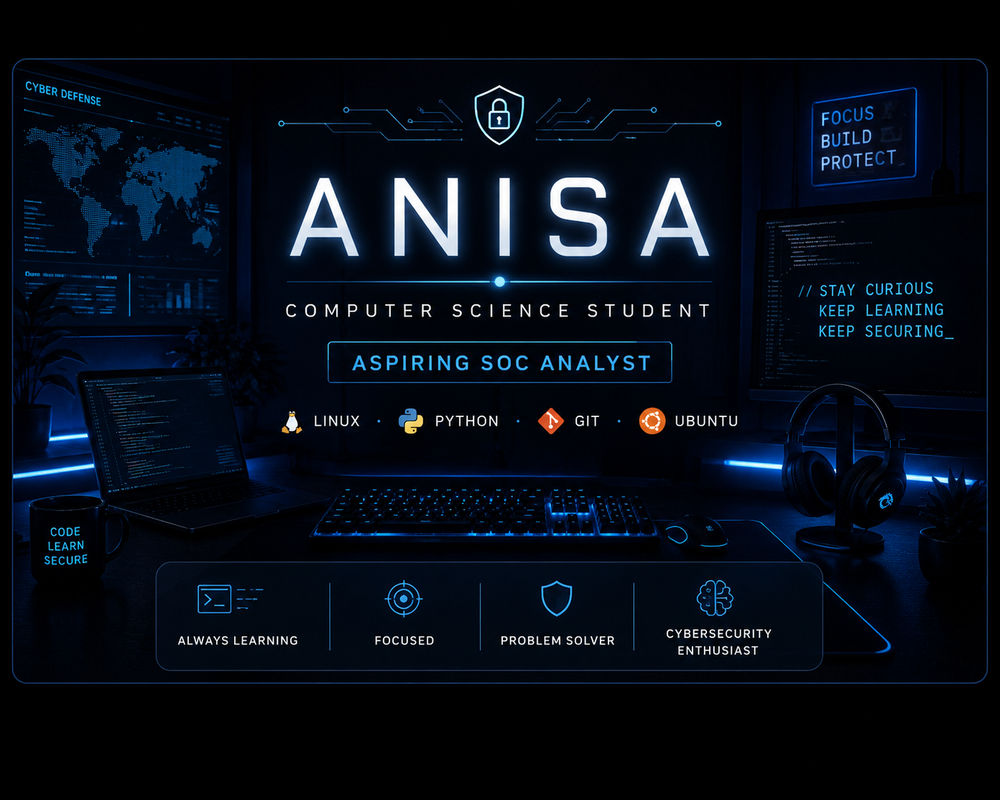

# ANISA

## 🛡️ About Me

Name: Anisa

Role: Computer Science Student

Career Goal: SOC Analyst

Currently Learning:
  - Linux
  - Python
  - Networking
  - Git & GitHub
  - SOC Fundamentals

Interests:
  - Blue Team
  - Threat Detection
  - Security Operations
  - Open Source

Motto:
  "Learn. Build. Secure."

## 💻 Tech Stack

## 📈 Contribution Activity

## 🎯 Currently Learning

- 🛡️ SOC Analyst Fundamentals
- 🐧 Linux Administration
- 🌐 Networking
- 🐍 Python for Cybersecurity
- 🔧 Git & GitHub

> **"Every expert was once a beginner. Every professional was once a student."**

## 🌐 Connect With Me

## 🚀 Featured Projects

| Project | Description |
|---------|-------------|
| 🔐 Password Strength Checker | Python project |
| 🌐 Network Scanner | Learning Project |
| 🐧 Linux Scripts | Automation |
| 📊 Log Analyzer | SOC Practice |
| 🛡️ SOC Home Lab | Coming Soon |

## 🐍 Contribution Snake

Coming Soon...

### ⭐ Thanks for visiting my profile ⭐

*"Always learning. Always building. Always improving."*

