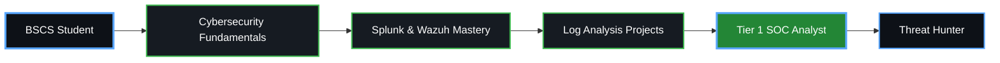

<!--
**Anisa/Anisa** - Aspiring Tier 1 SOC Analyst
-->

<!-- Animated Wave Header -->

<!-- Typing Animation -->

  

---

## 🛠️ Technical Arsenal

  
| **SIEM & Security** | **Operating Systems** | **Development** |
|:---:|:---:|:---:|
|  |  |  |
|  |  |  |
|  |  |  |
|  |  |  |

---

## 📊 GitHub Analytics Dashboard

<table>
<tr>
<td width="33%" align="center">

### 📈 Contributions

</td>
<td width="33%" align="center">

###  Languages

</td>
<td width="34%" align="center">

###  Streak

</td>
</tr>
<tr>
<td colspan="3" align="center">

###  Contribution Activity

</td>
</tr>
<tr>
<td width="50%" align="center">

### 🏆 Achievements

</td>
<td width="50%" align="center">

###  Contribution Grid

</td>
</tr>
</table>

---

##  Featured Projects

### 🔍 **Log Analysis & Threat Detection**
**Security Information and Event Management (SIEM) Project**

**Technologies:** Splunk | Wazuh | Python | Bash | Linux

*Real-time log parsing, threat detection, and security incident analysis using industry-standard SIEM tools*

---

<table>
<tr>
<td width="50%" align="center">

#### 📊 **SIEM Dashboard**
Custom dashboard for monitoring security events and alerts

[Learn More →](https://github.com/Anisa)

</td>
<td width="50%" align="center">

#### 🛡️ **Threat Hunting**
Automated threat detection scripts and playbooks

[Learn More →](https://github.com/Anisa)

</td>
</tr>
</table>

---

## 🎓 Certifications & Education

###  Professional Certifications

**Cybersecurity Fundamentals** - Coursera  
✅ *Completed 2026*

---

### 🎓 Current Education

**Bachelor of Science in Computer Science (BSCS)**  
📅 *In Progress*  
Focus: Cybersecurity & Network Security

---

## 🗺️ Career Roadmap

**Current Stage:**  Building Practical SOC Skills

---

## 🎯 SOC Analyst Skills Matrix

| **Skill Area** | **Proficiency** | **Tools** |
|:---|:---|:---|
| **SIEM Platforms** | ⭐⭐⭐ | Splunk, Wazuh |
| **Log Analysis** | ⭐⭐⭐⭐ | Splunk SPL, Regex |
| **Operating Systems** | ⭐⭐⭐⭐ | Linux, Ubuntu, Windows |
| **Scripting** | ⭐⭐ | Python, Bash |
| **Network Security** | ⭐⭐⭐ | Wireshark, TCP/IP |
| **Threat Detection** | ⭐⭐⭐ | MITRE ATT&CK, IOCs |

---

## 🐍 GitHub Snake Game

*The snake consumes my contributions!*

---

## 📫 Connect With Me

### Let's discuss cybersecurity and SOC opportunities!

---

##  Quote

> **"Security is not a product, but a process."*  
> — Bruce Schneier

---

## 📊 Profile Metrics

---

### ⚡ Powered by Coffee, Code & Cybersecurity ⚡️

**Last Updated:** July 2026

 
